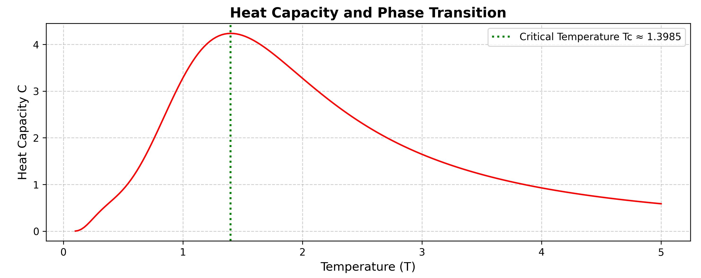

# Falsifiable theory of discrete Quantum Graph Universe  
**T_c - given in dimensionless units (see theory)**  

## License

This project is licensed under the Creative Commons Attribution-NonCommercial-ShareAlike 4.0 International License.  
You are free to share and adapt this material **non-commercially**, as long as you give appropriate attribution and distribute your contributions under the same license.  
See [LICENSE](LICENSE) for full details.

---
Copyright (c)2025 Sergej Materov. All Rights Reserved
---
Licensed: Creative Commons Attribution Non Commercial Share Alike 4.0 International.

